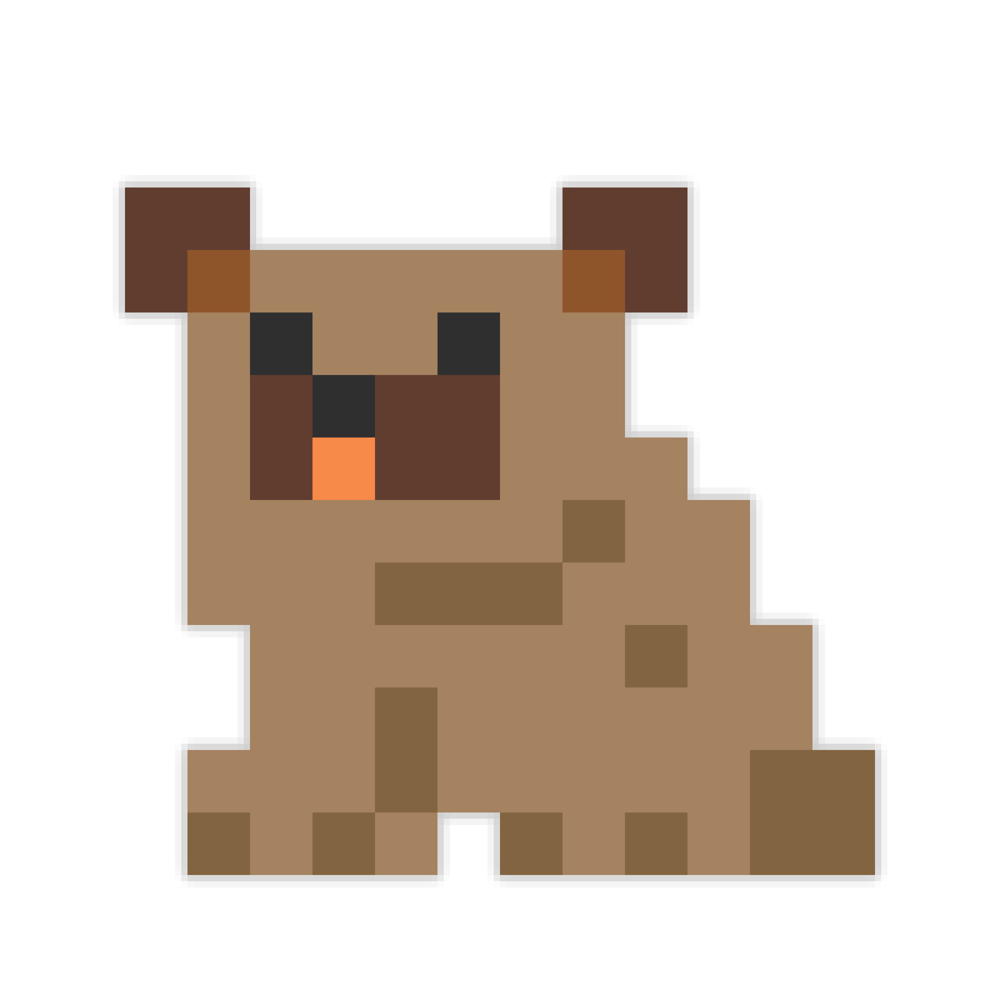

[license]: LICENSE
[license-shield]: https://img.shields.io/badge/License-MIT-yellow.svg
[release]: https://github.com/BurrowStudios/Bruno/releases
[release-shield]: https://img.shields.io/github/release/BurrowStudios/Bruno.svg

<!--suppress CheckImageSize, HtmlRequiredAltAttribute -->

[![license-shield][]][license]
[![release-shield][]][release]

# Bruno

An Issue Tracker System (ITS) that works within Discord via Forum Channels.

### ⚠️ Early development notice ⚠️

Please note that this application is still in early development.